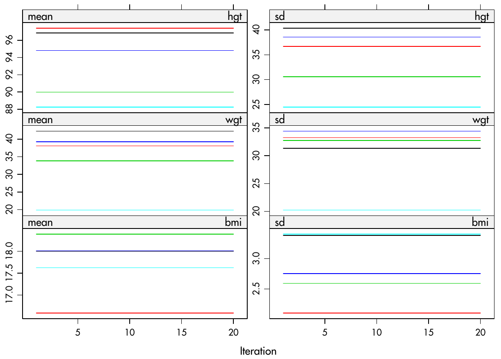
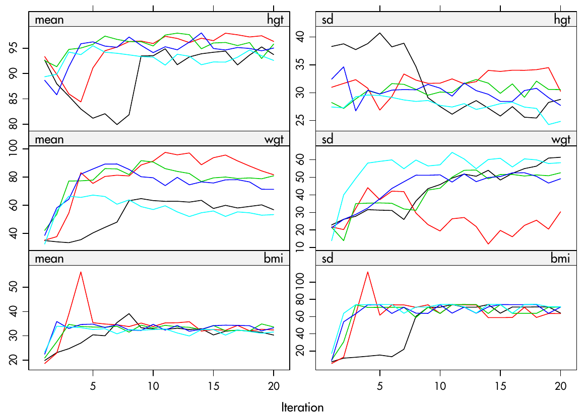

# Análisis con datos faltantes

## Introducción

- Los datos faltantes es uno de los temas que se ignoran en la mayoría de los textos introductorios. Probablemente, parte de la razón por la que esto es así es que todavía abundan muchos mitos sobre el análisis con datos ausentes. Además, algunas de las investigación sobre técnicas de vanguardia es aún relativamente nueva. Una razón más legítima para su ausencia en los textos introductorios es que la mayoría de las metodologías más de principios son bastante complicadas, desde el punto de vista matemático. Sin embargo, la increíble ubicuidad de los problemas relacionados con los datos faltantes en el análisis de datos de la vida real requiere que se aborde el tema. Esta sección sirve como una suave introducción al tema y a una de las técnicas más eficaces para tratarla. Un refrán común sobre el tema es algo así como que la mejor manera de tratar con los datos que faltan es no tenerlos. Es cierto que los datos que faltan son un tema complicado, y hay muchas maneras de hacerlo mal. Es importante no llevar este consejo al extremo, sin embargo, para eludir los problemas de los datos perdidos, algunos han impedido participantes en una encuesta, que por ejemplo, siguen sin responder a todas las preguntas de un formulario. 

- Hay tratamientos para los datos que faltan, pero no hay tratamientos para los datos malos. El tratamiento estándar para el problema de los datos que faltan es reemplazar los datos que faltan por valores no ausentes. Este proceso se denomina imputación. En la mayoría de los casos, el objetivo de la imputación no es recrear el conjunto de datos completo perdido, sino permitir que se realicen estimaciones o inferencias estadísticas válidas a partir de los datos perdidos. Por ello, la eficacia de las diferentes técnicas de imputación no puede evaluarse por su capacidad de recrear los datos con la mayor exactitud posible a partir de un conjunto de datos perdidos simulado, sino que deben juzgarse por su capacidad de apoyar las mismas inferencias estadísticas que se obtendrían del análisis de los datos completos que se extraen del análisis. 

- De este modo, rellenar los datos que faltan es sólo un paso hacia el verdadero objetivo: el análisis. El conjunto de datos imputados rara vez se considera el objetivo final de la imputación. En la práctica, hay muchas formas diferentes de tratar los datos que faltan, algunas son buenas y otras no tanto. Algunas están bien en determinadas circunstancias, pero no en otras. Algunas implican la eliminación de datos perdidos, mientras que otras implican la imputación. Vamos a mencionar brevemente algunos de los métodos más comunes. Sin embargo, el objetivo final de, es iniciarle en lo que a menudo se describe como el estándar de oro de las técnicas de imputación: la imputación múltiple.

## Visualización de los datos que faltan

- Para demostrar la visualización de patrones de datos ausentes, primero tenemos que crear algunos datos ausentes. Este será también el mismo conjunto de datos sobre el que realizaremos el análisis más adelante en el capítulo. Para mostrar cómo utilizar la imputación múltiple en un escenario semirealista, vamos a crear una versión del conjunto de datos `mtcars` con algunos valores perdidos: Configuremos `seed`  (para la aleatoriedad determinista), y creemos una variable para mantener nuestro nuevo conjunto de datos. Los datos se extrajeron de la revista **Motor Trend US** de 1974 y comprenden el consumo de combustible y 10 aspectos del diseño y el rendimiento de 32 automóviles (modelos de 1973 a 1974).

```{r}
set.seed(2)
miss_mtcars <- mtcars
```

- En primer lugar, vamos a crear siete valores faltantes en `drat` (alrededor del 20 por ciento), cinco valores faltantes en la columna `mpg` (alrededor del 15 por ciento), cinco valores faltantes en la columna `cyl`, tres valores faltantes en `wt` (alrededor del 10 por ciento), y tres valores faltantes en `vs`

```{r}
some_rows <- sample(1:nrow(miss_mtcars), 7)
miss_mtcars$drat[some_rows] <- NA

some_rows <- sample(1:nrow(miss_mtcars), 5)
miss_mtcars$mpg[some_rows] <- NA

some_rows <- sample(1:nrow(miss_mtcars), 5)
miss_mtcars$cyl[some_rows] <- NA

some_rows <- sample(1:nrow(miss_mtcars), 3)
miss_mtcars$wt[some_rows] <- NA

some_rows <- sample(1:nrow(miss_mtcars), 3)
miss_mtcars$vs[some_rows] <- NA
```

- Ahora, vamos a crear cuatro valores que faltan en `qsec`, pero sólo para los coches automáticos

```{r}
only_automatic <- which(miss_mtcars$am==0)
some_rows <- sample(only_automatic, 4)
miss_mtcars$qsec[some_rows] <- NA
```

Ahora, echemos un vistazo al conjunto de datos:

```{r}
head(miss_mtcars)
```

- Ahora vamos a visualizar los datos faltantes. La primera forma en que vamos a visualizar el patrón de los datos faltantes es utilizando la función función `md.pattern` del paquete `mice` (que es también el paquete que vamos a utilizar para imputar nuestros datos faltantes). Si no tiene el paquete
instálelo antes

```{r}
library(mice)
md.pattern(miss_mtcars)
```

- Un patrón de datos faltantes por fila se refiere a las columnas que faltan en cada fila. Esta función agrega y cuenta el número de filas con el mismo patrón de datos perdidos. Esta función produce una matriz binaria (0 y 1). Las celdas con un 1 representan datos no faltantes; los 0s representan datos que faltan. Como las filas están ordenadas en un orden creciente de ausencia, la primera fila siempre se refiere al patrón de datos ausentes que contiene la menor cantidad de datos faltantes.

- La columna más a la izquierda es un conteo del número de filas que muestran el patrón de datos faltantes, y la columna más a la derecha es un recuento del número de puntos de datos perdidos en ese patrón. La última fila contiene un recuento del número de puntos de datos que faltan en cada columna. Como puede ver, 12 de las filas no contienen datos perdidos. 

- Sólo hay seis filas que contienen más de un valor perdido. Sólo una de estas
filas contiene más de dos valores perdidos (como se muestra en la penúltima fila). En cuanto a los conjuntos de datos con datos faltantes, este en particular no contiene mucho. No es raro que en algunos conjuntos de datos falte más del 30% de los datos. Este conjunto de datos no llega ni al 3%. Ahora vamos a visualizar el patrón de datos faltantes gráficamente utilizando el paquete `VIM`. Probablemente también tenga que instalarlo.

```{r}
library(VIM)
aggr(miss_mtcars, numbers=TRUE)
```

```{r}
marginplot(miss_mtcars[c(1,2)])
```

- A simple vista, esta representación nos muestra, sin esfuerzo, que la columna `drat` representa la mayor proporción de faltas, por columnas, seguida de `mpg, cyl, qsec, vs.` y `wt`. El gráfico de la derecha nos muestra información similar a la de la salida de `md.pattern`. Esta representación, sin embargo, hace que sea más fácil saber si hay algún patrón sistemático de omisión. Las celdas azules representan los datos no ausentes, y las rojas representan los datos que faltan. Los números de la derecha del gráfico representan la proporción de filas que muestran ese patrón de datos perdidos. El 37,5% de las filas no contienen ningún tipo de dato que falte.

- El diagrama de caja rojo de la izquierda muestra la distribución de `cyl` sin `mpg`, mientras que el diagrama de caja azul muestra la distribución de los restantes puntos de datos. Lo mismo ocurre con los gráficos de caja de `mpg` en la parte inferior del gráfico. Si los datos tienen mecanismo `MCAR` se espera que los gráficos de caja rojos y azules sean muy similares.

## Tipos de datos faltantes

El paquete `VIM` nos permitió visualizar los patrones de datos que faltaban. Un término relacionado, el mecanismo de datos perdidos, describe el proceso que determina la probabilidad de que cada punto de datos sea faltante. Hay tres categorías principales de mecanismos de datos perdidos: **Missing Completely At Random (MCAR), Missing At Random (MAR)**, y **Missing Not At Random (MNAR)**. La discriminación basada en el mecanismo de datos perdidos es crucial, ya que nos informa sobre las opciones para manejar los datos faltantes.

- **Faltantes completamente al azar `(MCAR)`**

  - El primer mecanismo, `MCAR`, se produce cuando la falta de datos no está relacionada con la datos. Esto ocurriría, por ejemplo, si se borraran filas de una base de datos al azar, o si una ráfaga de viento se llevara una muestra aleatoria de los formularios de encuesta de un investigador. El mecanismo que rige la ausencia de `drat, mpg, cyl, wt`, y `vs`' es `MCAR`, porque seleccionamos al azar los elementos que faltan. Este mecanismo, aunque es el más fácil de trabajar, rara vez es sostenible en la práctica.

- **Faltantes no aleatorios (MNAR)**

  - El mecanismo `MNAR` se produce cuando la ausencia de una variable está relacionada con la variable en sí misma. Por ejemplo, supongamos que la báscula que pesa cada coche tiene una capacidad de sólo 3.700 libras y, por ello, los ocho coches que pesaban más se registraron como `NA`. Este es un ejemplo clásico del mecanismo `MNAR`, es el propio peso de la observación la causa de que falte. Otro ejemplo sería si durante el transcurso del ensayo de un fármaco antidepresivo los participantes a los que no les ayudaba el fármaco se deprimían demasiado para continuar con el ensayo. Al final del ensayo, cuando se accede y se registra el nivel de depresión de todos los participantes, habrá valores que falten para los participantes cuyo motivo de ausencia está relacionado con su nivel de depresión.


- **Faltantes al azar `(MAR)`**

  - El mecanismo, `faltante al azar`, tiene un nombre un tanto desafortunado, al contrario de lo que pueda parecer, significa que existe una relación sistemática entre la ausencia de una variable de resultado y otras variables observadas, pero no la variable de resultado en sí misma.
  
  - La mejor manera de explicarlo es con el siguiente ejemplo: Supongamos que en una encuesta hay una pregunta sobre el nivel de ingresos. Debido a ello, un gran número de participantes en la encuesta cuya lengua materna no es el inglés no pudo interpretar la pregunta y la dejaron en blanco. Si la encuesta sólo recogía el nombre, el sexo y los ingresos, el mecanismo de datos faltantes de la pregunta sobre los ingresos sería `MNAR`. Sin embargo, si el cuestionario incluía una pregunta sobre si el participante hablaba inglés como como primera lengua, el mecanismo sería `MAR`. La inclusión de la variable *Is English* significa que la falta de respuesta a la pregunta sobre los ingresos puede puede explicarse por completo. La razón por la que el nombre falta al azar es que cuando se controla la relación entre la variable omitida y la(s) variable(s) observada(s) con la que está relacionada (por ejemplo, ¿Cuál es su renta? y ¿Es el inglés su primera lengua? respectivamente), los datos faltan al azar.

  - Como otro ejemplo, existe una relación sistemática entre las variables `am` y `qsec` en nuestro conjunto de datos simulados que faltan: los `qsecs` sólo faltan en los coches automáticos. Pero dentro del grupo de coches automáticos, la variable `qsec` falta al azar. Por lo tanto, el mecanismo de `qsec` es `MAR`; controlando el tipo de transmisión, `qsec` falta al azar. Tenga en cuenta, sin embargo, que si eliminamos `am` de nuestro conjunto de datos simulado, `qsec` se convertiría en MNAR.
  

- **Observación**
  
  - Quizá haya observado que el lugar que ocupa un conjunto de datos concreto en la taxonomía del mecanismo de datos perdidos depende de las variables que incluye. Por ejemplo, sabemos que el mecanismo detrás de `qsec` es `MAR`, pero si el conjunto de datos no incluyera `am`, sería `MNAR`. Como somos nosotros los que creamos los datos, sabemos el procedimiento que dio lugar a los valores perdidos de `qsec`. Si no fuéramos nosotros los que creamos los datos, como ocurre en el mundo real, y el conjunto de datos no contuviera la columna `am` simplemente veríamos una cantidad de valores `qsec` que faltan arbitrariamente. Esto podría llevarnos a creer que los datos son `MCAR`. Sin embargo, no lo es; sólo porque la variable con la cual otra variable faltante está sistemáticamente relacionada no se observa, no quiere decir que esta no exista. Esto plantea una cuestión crítica: ¿podemos estar seguros de que nuestros datos no son `MCAR`? La respuesta desafortunada es no. Dado que los datos que necesitamos para demostrar o refutar el `MNAR` faltan *ipso facto*, la suposición de `MNAR` nunca puede ser desconfirmada de forma concluyente. Es nuestro trabajo, como analistas de datos con pensamiento crítico, preguntar si es probable que haya un mecanismo `MNAR` o no.


### Visualización de datos faltantes

- Tomando el conjunto de datos `airquality`, un conjunto de datos de mediciones diarias de la calidad del aire en Nueva York de mayo a septiembre de 1973, que tiene valores `NA` dentro de sus variables. Las filas del conjunto de datos representan 154 días consecutivos. Cualquier eliminación de estas filas afectará a la continuidad del tiempo, lo que puede *afectar a cualquier análisis de series temporales que se realice*. Veamos con más detalle el conjunto de datos de la calidad del aire

- Iniciamos visualizando los datos faltantes. Eliminaremos algunos puntos de datos del conjunto de datos para este ejemplo. En lo que respecta a las variables categóricas, la sustitución de las mismas no suele ser aconsejable. Algunas prácticas comunes incluyen la sustitución de las variables categóricas que faltan por la moda de las observadas, sin embargo, es cuestionable si es una buena opción. Aunque en este caso no faltan puntos de datos de las variables categóricas, las eliminamos de nuestro conjunto de datos (podemos volver a añadirlas más tarde si es necesario) y echamos un vistazo a los datos utilizando `summary()`

```{r}
data <- airquality
data[4:10, 3] <- rep(NA, 7)
data[1:5, 4] <- NA
```

```{r}
data <- data[-c(5,6)]
summary(data)
```

- Al parecer, el `Ozone` es la variable con más puntos de datos perdidos. A continuación vamos a profundizar en los patrones de datos que faltan. Suponiendo que los datos sean `MCAR`, demasiados datos perdidos también pueden ser un problema. Por lo general, un umbral máximo seguro es el 5% del total para conjuntos de datos grandes. Si los datos que faltan para una determinada característica o muestra son superiores al 5%, probablemente deba dejar de lado esa característica o muestra. Por lo tanto, comprobamos las características (columnas) y las muestras (filas) en las que falta más del 5% de los datos mediante una sencilla función


```{r}
pMiss <- function(x){sum(is.na(x))/length(x)*100}
apply(data,2,pMiss)
apply(data,1,pMiss)
```

- Vemos que al ozono le falta casi el 25% de los puntos de datos, por lo que podríamos considerar la posibilidad de eliminarlo del análisis o de reunir más mediciones. Las demás variables están por debajo del umbral del 5%, por lo que podemos mantenerlas. En lo que respecta a las muestras, la falta de una sola característica supone un 25% de datos perdidos por muestra. Las muestras a las que les faltan 2 o más características (> 50%) deben ser eliminadas si es posible.

- Usemos `md.pattern()` para conocer mejor el patrón de los datos que faltan


```{r}
library(mice)
md.pattern(data)
```

- La salida nos dice que 104 muestras están completas, que a 34 muestras les falta sólo la medición de `Ozone`, que a 4 muestras les falta sólo el valor de `Solar.R` y así sucesivamente. Una representación visual quizás más útil puede obtenerse utilizando el paquete `VIM` de la siguiente manera

```{r}
library(VIM)

aggr_plot <- aggr(data, col=c('navyblue','red'), numbers=TRUE, sortVars=TRUE, labels=names(data),
                  cex.axis=.7, gap=3, ylab=c("Histogram of missing data","Pattern"))
```

- El gráfico nos ayuda a entender que a casi el 70% de las muestras no les falta ninguna información, al 22% le falta el valor de `Ozono` y las restantes muestran otros patrones de ausencia. A través de este enfoque, la situación parece un poco más clara. Otra aproximación visual (esperemos) útil es un gráfico de caja especial


```{r}
marginplot(data[c(1,2)])
```

- Obviamente, aquí estamos limitados a trazar sólo 2 variables a la vez, pero sin embargo podemos obtener algunas ideas interesantes. El diagrama de caja rojo de la izquierda muestra la distribución de `Solar.R` sin `Ozono`, mientras que el diagrama de caja azul muestra la distribución de los restantes puntos de datos. Lo mismo ocurre con los gráficos de caja de `Ozono` en la parte inferior del gráfico. Si nuestra suposición de los datos `MCAR` es correcta, entonces esperamos que los gráficos de caja rojos y azules sean muy similares.

### Borrado de la lista

- El método más utilizado por los científicos de datos para tratar los datos que faltan es simplemente omitir los casos con datos que faltan, analizando únicamente el resto del conjunto de datos. Este método se conoce como eliminación por lista o análisis de casos completos. La función `na.omit()` en `R` elimina todos los casos con uno o más valores de datos perdidos en un conjunto de datos.

- La mayor ventaja de este método es su comodidad. Sin embargo, si la naturaleza de los datos es `MCAR`, la eliminación de la lista dará lugar a errores estándar que son significativos para los datos reducidos, pero no para todo el conjunto de datos, que tenía los datos que faltaban. Este método de tratar los datos que faltan es posiblemente un desperdicio. Si se eliminan los casos de esta manera, hay que ser consciente de la disminución de la capacidad para detectar el verdadero efecto de las variables de interés.

- Sin embargo, si los datos no son `MCAR`, el análisis de casos completos puede influir mucho en las estimaciones de la media, los coeficientes de regresión y las correlaciones. La supresión de la lista puede causar submuestras sin sentido.


- A continuación, realizamos una simple función `na.omit()` para eliminar los casos que tienen `NAs`. Vemos que todas las filas que contenían algún `NA` en cualquier variable son eliminadas del dataframe

```{r}
airquality_omit <- na.omit(data)
head(airquality_omit)
```

- Dibujemos los histogramas antes y después de la imputación usando `ggplot`

```{r}
library(ggplot2)
library(tidyverse)
library(hrbrthemes)
library(gridExtra)
```


```{r}
ggp1 <- ggplot(data.frame(value=data$Ozone), aes(x=value)) +
  geom_histogram(fill="#FBD000", color="#E52521", alpha=0.9) +
  ggtitle("Original data") +
  xlab('Ozone') + ylab('Frequency') +
  theme_ipsum() +
  theme(plot.title = element_text(size=15))

ggp2 <- ggplot(data.frame(value=airquality_omit$Ozone), aes(x=value)) +
  geom_histogram(fill="#43B047", color="#049CD8", alpha=0.9) +
  ggtitle("Listwise Deletion") +
  xlab('Ozone') + ylab('Frequency') +
  theme_ipsum() +
  theme(plot.title = element_text(size=15))

grid.arrange(ggp1, ggp2, ncol = 2)
```

### Imputación de la media

- Algunos científicos de datos o estadísticos pueden buscar una solución rápida sustituyendo los datos que faltan por la media. La media se utiliza a menudo para imputar datos categóricos. Por ejemplo, en el conjunto de datos de calidad del aire, supongamos que queremos imputar la media de sus valores perdidos. En este caso, utilizamos el paquete `R` `mice`. Cambiando el argumento `method = mean`, se especifica la imputación de la media, el argumento `m = 1` cambia las iteraciones a 1, lo que significa no (iteración).

- El fundamento teórico de utilizar la media para imputar los datos perdidos es que la media es una buena estimación para seleccionar aleatoriamente una observación de una distribución normal. Ahora, intentaremos imputar la media para las variables `Ozono` y `Solar.R` del conjunto de datos `airquality`. En primer lugar, vamos a cargar los paquetes `mice` y `mipackages` (instale el paquete de `CRAN` primero usando `install.packages("mice")` y `install.packages("mi")`). Para mas información sobre el paquete utlizado visitar https://cran.r-project.org/web/packages/mice/mice.pdf. Podemos recuperar el conjunto de datos completo utilizando la función `complete()`.

```{r}
library(mice)
library(foreign)
```

- La media de las variables `Ozono` y `Solar.R` puede ser imputada por la función `mice()`. 

```{r}
imp <- mice(data, m=5, maxit=50, method ='pmm', seed=500, printFlag = FALSE)
```

- Donde `m=5` se refiere al número de conjuntos de datos imputados. Cinco es el valor por defecto. `meth='pmm'` se refiere al método de imputación. En este caso, utilizamos el método de imputación de coincidencia de medias predictivas. Se pueden utilizar otros métodos de imputación, escriba `methods(mice)` para obtener una lista de los métodos de imputación disponibles.

```{r}
imp_df <- complete(imp)
head(imp_df)
```

- Veamos un histograma y un diagrama de dispersión del aspecto del conjunto de datos de la calidad del aire tras la imputación de la media


```{r}
ggp1 <- ggplot(data.frame(value=data$Ozone), aes(x=value)) +
  geom_histogram(fill="#FBD000", color="#E52521", alpha=0.9) +
  ggtitle("Original data") +
  xlab('Ozone') + ylab('Frequency') +
  theme_ipsum() +
  theme(plot.title = element_text(size=15))

ggp2 <- ggplot(data.frame(value=imp_df$Ozone), aes(x=value)) +
  geom_histogram(fill="#43B047", color="#049CD8", alpha=0.9) +
  ggtitle("Mean imputation") +
  xlab('Ozone') + ylab('Frequency') +
  theme_ipsum() +
  theme(plot.title = element_text(size=15))

grid.arrange(ggp1, ggp2, ncol = 2)
```

- Vamos a comparar las distribuciones de los datos originales e imputados utilizando algunos gráficos útiles. En primer lugar, podemos utilizar un gráfico de dispersión y comparar `Ozone` con todas las demás variables

```{r}
library(lattice)
xyplot(imp, Ozone ~ Wind + Temp + Solar.R, pch=18, cex=1)
```

- Lo que queremos ver es que la forma de los puntos (imputados) coincida con la de los azules (observados). La coincidencia de la forma nos indica que los valores imputados son realmente *valores plausibles*. Otro gráfico útil es el de la densidad:

```{r}
densityplot(imp)
```

- La densidad de los datos imputados para cada conjunto de datos imputados se muestra en color magenta, mientras que la densidad de los datos observados se muestra en azul. De nuevo, según nuestros supuestos anteriores, esperamos que las distribuciones sean similares.

- Es muy recomendable comprobar visualmente la convergencia. Lo comprobamos cuando llamamos a la función de trazado en la variable a la que asignamos la salida de `mice`, para mostrar gráficos de seguimiento de la media y desviación estándar de todas las variables implicadas en las imputaciones. 

```{r}
plot(imp)
```

- Cada línea es una de las `m` imputaciones. Como se puede ver en el gráfico de trazado anterior sobre `imp`, no hay tendencias claras y las variables se superponen de una iteración a la siguiente. Dicho de otro modo, la varianza dentro de una cadena (hay `m` cadenas) debería ser aproximadamente igual a la varianza entre las cadenas. Esto indica que se ha logrado la convergencia. Si no se logra la convergencia, se puede aumentar el número de iteraciones que `mice` emplea especificando explícitamente el parámetro `maxit` a la función `mice`. Los siguientes son ejemplos de no convergencia usando el alogritmo `mice`





### Otras técnicas de imputación

- La función `mice` entrega distintos métodos de imputación los cuales puede estudiar y aplicar, de acuerdo a lo que requieran sus datos. Puede aplicar la `imputación por regresión` en R con la configuración del método `method = "norm.predict"` en la función `mice`. Puede aplicar la imputación de `regresión estocástica` en `R` con la función `mice` utilizando el método `method = "norm.nob"`. El paquete `mice` también incluye un procedimiento de imputación de regresión estocástica bayesiana. Puede aplicar este procedimiento de imputación con la función `mice` y utilizar como método `method = "norm"`. Para estos métodos debe seleccionar primero dos columna del conjunto de datos de interes para ajustar constantes del modelo.

```{r}
data <- data[, c("Solar.R", "Wind")]
imp.regress <- mice(data, method="norm.predict", m=1, maxit=1)
imp.regress$imp$Wind
```

- En la actualidad, hay un número limitado de análisis que pueden ser automáticamente agrupados por  `mice` el más importante es el de `lm/glm`. Sin embargo, si se recuerda, el modelo lineal generalizado es extremadamente flexible, y puede utilizarse para expresar una amplia gama de análisis diferentes. Por extensión, podríamos utilizar la imputación múltiple no sólo para regresión lineal, sino para la regresión logística, la regresión de Poisson, las pruebas $t$, el `ANOVA`
`ANCOVA`, etc. Cada una de estas temáticas pueden ser abordadas como proyectos en este curso.

## Detección de valores atípicos

- Un valor atípico es un valor o una observación que se aleja de otras observaciones, es decir, un punto de datos que difiere significativamente de otros puntos de datos. *Enderlein (1987)* va incluso más allá, ya que el autor considera que los valores atípicos son aquellos que se desvían tanto de otras observaciones que se podría suponer un mecanismo de muestreo subyacente diferente.

- Una observación debe compararse siempre con otras observaciones realizadas sobre el mismo fenómeno antes de calificarla realmente de atípica. En efecto, una persona de 200 cm de altura (1,90 m en EE.UU.) se considerará probablemente un valor atípico en comparación con la población general, pero esa misma persona podría no considerarse un valor atípico si midiéramos la altura de los jugadores de baloncesto.

- En esta sección, presentamos varios enfoques para detectar valores atípicos en `R`, desde técnicas sencillas como la estadística descriptiva (que incluye el mínimo, el máximo, el histograma, el boxplot y los percentiles) hasta técnicas más formales como el filtro de `Hampel`, el `Grubbs`, el `Dixon` y las pruebas de `Rosner` para detectar valores atípicos. Algunas pruebas estadísticas exigen la ausencia de valores atípicos para sacar conclusiones sólidas, pero la eliminación de valores atípicos no se recomienda en todos los casos y debe hacerse con precaución.

### Estadísticas descriptivas

- El primer paso para detectar los valores atípicos en `R` es comenzar con algunas estadísticas descriptivas, y en particular con el mínimo y el máximo. En `R`, esto se puede hacer fácilmente con la función `summary()`

```{r}
dat <- ggplot2::mpg
summary(dat$hwy)
```

- Nótese que el mínimo y el máximo son, respectivamente, el primer y el último valor de la salida anterior. Como alternativa, también pueden calcularse con las funciones `min()` y `max()`

```{r}
min(dat$hwy)
```

```{r}
max(dat$hwy)
```

- Un claro error de codificación, como un peso de 786 kg (1733 libras) para un humano, ya se detectará fácilmente con esta técnica tan sencilla.

### Histogramas 

- Otra forma básica de detectar valores atípicos es dibujar un histograma de los datos. Utilizando la base de `R` (con el número de `bins` correspondiente a la raíz cuadrada del número de observaciones para tener más `bins` que la opción por defecto), o usando `ggplot2`

```{r}
hist(dat$hwy,
  xlab = "hwy",
  main = "Histogram of hwy",
  breaks = sqrt(nrow(dat))
)
```

```{r}
library(ggplot2)

ggplot(dat) +
  aes(x = hwy) +
  geom_histogram(bins = 30L, fill = "#0c4c8a") +
  theme_minimal()
```

- Según el histograma, parece que hay un par de observaciones más altas que todas las demás

### Boxplot

- Además de los histogramas, los `boxplots` también son útiles para detectar posibles valores atípicos

```{r}
boxplot(dat$hwy,
  ylab = "hwy"
)
```

```{r}
ggplot(dat) +
  aes(x = "", y = hwy) +
  geom_boxplot(fill = "#0c4c8a") +
  theme_minimal()
```

- Un diagrama de caja ayuda a visualizar una variable cuantitativa mostrando cinco resúmenes de localización comunes (mínimo, mediana, primer y tercer cuartil y máximo) y cualquier observación que se haya clasificado como presunto valor atípico utilizando el criterio del rango intercuartílico `(IQR)`. 

- Las observaciones consideradas como posibles valores atípicos según el criterio `IQR` se muestran como puntos en el diagrama de caja. Según este criterio, hay 2 valores atípicos potenciales (véanse los 2 puntos por encima de la línea vertical, en la parte superior del `boxplot`).

- Recuerde que no por el hecho de que una observación sea considerada como un valor atípico potencial por el criterio IQR debe eliminarla. Eliminar o mantener un valor atípico depende de (i) el contexto de su análisis, (ii) si las pruebas que va a realizar en el conjunto de datos son robustas a los valores atípicos o no, y (iii) a qué distancia está el valor atípico de otras observaciones.

- También es posible extraer los valores de los posibles valores atípicos basándose en el criterio `IQR` gracias a la función `boxplot.stats()$out`:

```{r}
boxplot.stats(dat$hwy)$out
```

- Como puede ver, en realidad hay 3 puntos considerados como posibles valores atípicos: 2 observaciones con un valor de 44 y 1 observación con un valor de 41. Gracias a la función `which()` es posible extraer el número de fila correspondiente a estos valores atípicos:

```{r}
out <- boxplot.stats(dat$hwy)$out
out_ind <- which(dat$hwy %in% c(out))
out_ind
```

- Con esta información, ahora puede volver fácilmente a las filas específicas del conjunto de datos para verificarlas, o imprimir todas las variables para estos valores atípicos:

```{r}
dat[out_ind, ]
```

- También es posible imprimir los valores de los valores atípicos directamente en el boxplot con la función `mtext()`

```{r}
boxplot(dat$hwy,
        ylab = "hwy",
        main = "Boxplot of highway miles per gallon"
)
mtext(paste("Outliers: ", paste(out, collapse = ", ")))
```

### Percentiles

- Este método de detección de valores atípicos se basa en los percentiles. Con el método de los percentiles, todas las observaciones que se encuentren fuera del intervalo formado por los percentiles 2.5 y 97.5 se considerarán como posibles valores atípicos. También pueden considerarse otros percentiles, como el 1 y el 99, o el 5 y el 95, para construir el intervalo.

$$
I=[q_{0.25}-1.5\cdot\textsf{IQR}; q_{0.75}+1.5\cdot\textsf{IQR}]
$$

- Los valores de los percentiles inferior y superior (y, por tanto, los límites inferior y superior del intervalo) pueden calcularse con la función `quantile()`

```{r}
lower_bound <- quantile(dat$hwy, 0.025)
lower_bound
```

```{r}
upper_bound <- quantile(dat$hwy, 0.975)
upper_bound
```

- Según este método, todas las observaciones por debajo de 14 y por encima de 35,175 se considerarán posibles valores atípicos. Los números de fila de las observaciones fuera del intervalo pueden extraerse entonces con la función `which()`

```{r}
outlier_ind <- which(dat$hwy < lower_bound | dat$hwy > upper_bound)
outlier_ind
```

```{r}
dat[outlier_ind, "hwy"]
```

```{r}
dat[outlier_ind, ]
```

- Hay 11 valores atípicos potenciales según el método de los percentiles. Para reducir este número, puede establecer los percentiles en 1 y 99:

```{r}
lower_bound <- quantile(dat$hwy, 0.01)
upper_bound <- quantile(dat$hwy, 0.99)

outlier_ind <- which(dat$hwy < lower_bound | dat$hwy > upper_bound)

dat[outlier_ind, ]
```

### Filtro de Hampel

- Otro método, conocido como *filtro de Hampel*, consiste en considerar como valores atípicos los valores fuera del intervalo formado por la mediana, más o menos 3 desviaciones absolutas de la mediana

$$
I=[\tilde{X}-3\cdot\textsf{MAD}, \tilde{X}+3\cdot\textsf{MAD}],
$$
  donde `MAD` es la desviación absoluta de la mediana y se define como la mediana de las desviaciones absolutas de la mediana $\tilde{X}=\textsf{median}(X)$ de los datos

$$
\textsf{MAD}=\textsf{median}(|X_{i}-\tilde{X}|)
$$
- Para este método, primero establecemos los límites del intervalo, gracias a las funciones `median()` y `mad()`

```{r}
lower_bound <- median(dat$hwy) - 3 * mad(dat$hwy, constant = 1)
lower_bound
```


```{r}
upper_bound <- median(dat$hwy) + 3 * mad(dat$hwy, constant = 1)
upper_bound
```

- Según este método, todas las observaciones por debajo de 9 y por encima de 39 se considerarán como posibles valores atípicos. Los números de fila de las observaciones que están fuera del intervalo pueden entonces extraerse con la función `which()`. Según el filtro de `Hampel`, hay 3 valores atípicos para la variable `hwy`.

```{r}
outlier_ind <- which(dat$hwy < lower_bound | dat$hwy > upper_bound)
outlier_ind
```

### Prueba de Grubbs

- La prueba de `Grubbs` permite detectar si el valor más alto o más bajo de un conjunto de datos es un valor atípico. La prueba de `Grubbs` detecta un valor atípico cada vez (valor más alto o más bajo), por lo que las hipótesis nula y alternativa son las siguientes

  - $H_{0}$: El valor más alto/bajo no es un valor atípico
  - $H_{1}$: El valor más alto/bajo es un valor atípico

- Como para cualquier prueba estadística, si el valor $p$ es inferior al umbral de significación elegido (generalmente $\alpha=0.05$), se rechaza la hipótesis nula y se concluye que el valor más bajo/más alto es un valor atípico. Por el contrario, si el valor $p$ es mayor o igual que el nivel de significación, no se rechaza la hipótesis nula y concluiremos que, basándonos en los datos, no rechazamos la hipótesis de que el valor más bajo/más alto no es un valor atípico. Tenga en cuenta que la prueba de `Grubbs` no es apropiada para un tamaño de muestra $n\leq6$. Para realizar la prueba de `Grubbs` en `R`, utilizamos la función `grubbs.test()` del paquete `outliers`


```{r}
library(outliers)
test <- grubbs.test(dat$hwy)
test
```

- El valor $p$ es de 0.056. Al nivel de significación del 5%, no rechazamos la hipótesis de que el valor más alto 44 no es un valor atípico. Por defecto, la prueba se realiza sobre el valor más alto (como se muestra en la salida de `R`: hipótesis alternativa: el valor más alto 44 es un valor atípico). Si desea realizar la prueba para el valor más bajo, simplemente añada el argumento `opposite = TRUE` en la función `grubbs.test()`

```{r}
test <- grubbs.test(dat$hwy, opposite = TRUE)
test
```

- La salida de `R` indica que la prueba se realiza ahora sobre el valor más bajo (véase la hipótesis alternativa: el valor más bajo 12 es un valor atípico). El valor $p$ es 1. Al nivel de significación del 5%, no rechazamos la hipótesis de que el valor más bajo 12 no es un valor atípico.

  - A modo de ilustración, sustituiremos ahora una observación por un valor más extremo y realizaremos la prueba de `Grubbs` en este nuevo conjunto de datos. Reemplacemos el $34^{\text{th}}$ por un valor de 212

```{r}
dat[34, "hwy"] <- 212
```

- Y ahora aplicamos la prueba de `Grubbs` para comprobar si el valor más alto es un valor atípico

```{r}
test <- grubbs.test(dat$hwy)
test
```

- El valor $p$ es < 0.001. Al nivel de significación del 5%, concluimos que el valor más alto 212 es un valor atípico.

### Prueba de Dixon

- Al igual que la prueba de *Grubbs*, la prueba de *Dixon* se utiliza para comprobar si un único valor bajo o alto es un valor atípico. Por lo tanto, si se sospecha que hay más de un valor atípico, la prueba tiene que realizarse en estos valores atípicos sospechosos individualmente.

- Tenga en cuenta que la prueba de `Dixon` es más útil para muestras de pequeño tamaño (normalmente $n\leq 25). Para realizar la prueba de `Dixon` en `R`, utilizamos la función `dixon.test()` del paquete `outliers`. Sin embargo, restringimos nuestro conjunto de datos a las `20` primeras observaciones, ya que la prueba de `Dixon` sólo se puede realizar en muestras de pequeño tamaño (`R` arrojará un error y sólo acepta conjuntos de datos de 3 a 30 observaciones)

```{r}
subdat <- dat[1:20, ]
test <- dixon.test(subdat$hwy)
test
```

- Los resultados muestran que el valor más bajo, 15, es un valor atípico (valor $p = 0.007$). Para comprobar el valor más alto, basta con añadir el argumento `opuesto = TRUE` a la función `dixon.test()`

```{r}
test <- dixon.test(subdat$hwy, opposite = TRUE)
test
```

- Los resultados muestran que el valor más alto 31 no es un valor atípico (valor $p = 0.858$). Es una buena práctica comprobar siempre los resultados de la prueba estadística de valores atípicos con el diagrama de caja para asegurarse de que hemos comprobado todos los valores atípicos potenciales

```{r}
out <- boxplot.stats(subdat$hwy)$out
boxplot(subdat$hwy, ylab = "hwy")
mtext(paste("Outliers: ", paste(out, collapse = ", ")))
```

- A partir del `boxplot`, vemos que también podríamos aplicar la prueba de `Dixon` sobre el valor 20 además del valor 15 realizado anteriormente. Esto puede hacerse encontrando el número de fila del valor mínimo, excluyendo este número de fila del conjunto de datos y aplicando finalmente la prueba de `Dixon` a este nuevo conjunto de datos

```{r}
remove_ind <- which.min(subdat$hwy)
subsubdat <- subdat[-remove_ind, ]

test <- dixon.test(subsubdat$hwy)
test
```

- Los resultados muestran que el segundo valor más bajo, 20, no es un valor atípico (valor $p$ = 0.13).


### Prueba de Rosner

- La prueba de `Rosner` para detectar valores atípicos tiene las siguientes ventajas. Se utiliza para detectar varios valores atípicos a la vez (a diferencia de la prueba de `Grubbs` y `Dixon`, que debe realizarse de forma iterativa para detectar múltiples valores atípicos), y está diseñado para evitar el problema del enmascaramiento, en el que un valor atípico cercano a otro atípico puede pasar desapercibido. A diferencia de la prueba de `Dixon`, hay que tener en cuenta que la prueba de `Rosner` es más apropiada cuando el tamaño de la muestra es grande ($n\geq 20$). Por tanto, volvemos a utilizar el conjunto de datos inicial `dat`, que incluye 234 observaciones.

- Para realizar la prueba de `Rosner` utilizamos la función `rosnerTest()` del paquete `EnvStats`. Esta función requiere al menos 2 argumentos: los datos y el número de presuntos valores atípicos `k` (con `k = 3` como número de presuntos valores atípicos por defecto). Para este ejemplo, establecemos que el número de presuntos valores atípicos sea igual a 3, tal y como sugiere el número de posibles valores atípicos esbozado en el `boxplot` al principio del artículo.

```{r}
library(EnvStats)
test <- rosnerTest(dat$hwy, k = 3)
test
```

- Los resultados interesantes se ofrecen en la tabla `all.stats`

```{r}
test$all.stats
```

- Basándonos en la prueba de `Rosner`, vemos que sólo hay un valor atípico (véase la columna de valores atípicos), y que es la observación `34` (véase `Obs.Num`) con un valor de `212` (véase `Value`).

### Tratamiento de los valores atípicos

- Una vez identificados los valores atípicos y habiendo decidido enmendar la situación según la naturaleza del problema, puede considerar uno de los siguientes enfoques.

- **Imputación**

  Este método se ha tratado en detalle en la discusión sobre el tratamiento de los valores faltantes.

- **Capping**

  Para los valores que se encuentran fuera de los límites de $15\cdot\mathsf{IQR}$, podríamos poner un tope sustituyendo las observaciones que se encuentran fuera del límite inferior por el valor del $5^{\textsf{th}}$ percentile y las que se encuentran por encima del límite superior, por el valor del $95^{\textsf{th}}$ percentile. A continuación se muestra un código de ejemplo que logra esto
  
```{r}
x <- dat$hwy
qnt <- quantile(x, probs=c(.25, .75), na.rm = T)
caps <- quantile(x, probs=c(.05, .95), na.rm = T)
H <- 1.5 * IQR(x, na.rm = T)
x[x < (qnt[1] - H)] <- caps[1]
x[x > (qnt[2] + H)] <- caps[2]
head(x)
```

- **Predicción**
  
  En otro enfoque, los valores atípicos pueden sustituirse por valores perdidos `(NA)` y luego pueden predecirse considerándolos como una variable de respuesta. Ya hemos hablado de cómo predecir los valores perdidos en la sección anterior.