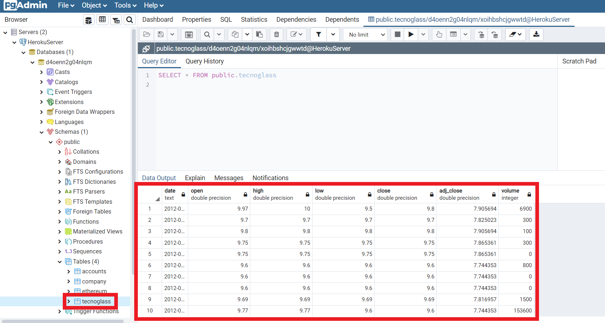

# Introducción a PostgreSQL en R

- Cuando se trata de grandes conjuntos de datos que potencialmente exceden la memoria de su máquina, es bueno tener otra posibilidad, como su propio servidor con una base de datos `SQL/PostgreSQL`, donde se puede consultar los datos. Por ejemplo, un conjunto de datos financieros de 5 GB caben en una memoria RAM básica, pero los datos consumen muchos recursos. Una solución es utilizar una base de datos basada en `SQL`, donde puedo consultar los datos en trozos más pequeños, dejando recursos para el cálculo.

- Aunque `MySQL` es la más utilizada, `PostgreSQL` tiene la ventaja de ser de código abierto y gratuita para todos los usos. Sin embargo, todavía tenemos que conseguir un servidor. Una forma posible de hacerlo es alquilar un servidor de `Amazon`, sin embargo, existe la opción de utilizar `Heroku Postgres` tal como se explicó en la sección de `Python`. 

## Conexión con R

- Ahora es el momento de conectarse a la base de datos con `R`. Este enfoque utiliza el paquete `RPostgreSQL`. Los siguientes paquetes y herramientas deben ser instaladas para poder hacer uso de la `API` y realizar la conexión con éxito

  - RPostgresql
  - DBI
  - Su propia base de datos PostgreSQL
  - Acceso remoto a su base de datos

- El paquete `RPostgreSQL` y `DBI` se puede instalar desde `CRAN` o `Github`

```{r eval = FALSE}
install.packages("RPostgreSQL")
install.packages("DBI")
devtools::install_git('https://github.com/r-dbi/DBI.git')
devtools::install_git('https://github.com/cran/RPostgreSQL.git)
```

- Para conectar, necesitamos introducir los siguientes comandos en `R`, nos conectaremos a la base de datos creada anteriormente en `Heroku Postgres` en la sección  de `Python`. `RPostgres` es una interfaz compatible con `DBI` para la base de datos `Postgres`. Es una reescritura desde cero usando `C++` y `Rcpp`. Este paquete actúa tanto como el controlador de la base de datos como la interfaz `DBI`. El código y la información adicional están disponibles en su repositorio `GitHub` aquí: [RPostgres](https://github.com/r-dbi/RPostgres). Debe modificar la información que recibe la funcion `dbConnect()` por aquella que obtuvo al crear su base de datos en `Heroku Postgres`

```{r}
library(DBI)
library(RPostgreSQL)

con <- dbConnect(RPostgres::Postgres(), 
                dbname = "d4oenn2g04nlqm", 
                host = "ec2-34-205-14-168.compute-1.amazonaws.com", 
                port = 5432, 
                user = "xoihbshcjgwwtd", 
                password = "aac4c765bf11a3982c859f19dcd57848c55b6e7b713fb98ca05e3711f2b9d7e9")
```


- Para visualizar la lista de tablas que hemos importado antes en la base de datos utilizamos `dbListTables()`

```{r}
dbListTables(conn = con)
```

## Importación de tablas

- Carguemos como `dataframe` un archivo `CSV` que contiene los precios de las acciones de `Tecnoglass Inc. (TGLS)`, empresa `Barranquillera` que cotiza en `Nasdaq`. Para esto usamos la función `read.csv()`

```{r}
TGLS_df <- read.csv(file = 'TGLS.csv')
head(TGLS_df)
```

- Los nombres de las columnas de este dataframe son problemáticos para las bases de datos (y especialmente para `PostgreSQL`) por varias razones: los `"."` en los nombres pueden ser un problema, `PostgreSQL` espera que los nombres de las columnas estén todos en minúsculas. Aquí hay una función para hacer que los nombres de las columnas sean seguros para las bases de datos. Luego obtenemos algunos estadísticos usando la función `summary()`

```{r}
dbSafeNames = function(names) {
  names = gsub('[^a-z0-9]+','_',tolower(names))
  names = make.names(names, unique=TRUE, allow_=TRUE)
  names = gsub('.','_',names, fixed=TRUE)
  names
}
colnames(TGLS_df) = dbSafeNames(colnames(TGLS_df))
head(TGLS_df)
```

```{r}
summary(TGLS_df)
```
- Ahora procedemos a insertar tabla `TGLS_df` en nuestra base de datos `Heroku Postgres` usando la función `dbWriteTable()`

```{r}
dbWriteTable(con, 'tecnoglass', TGLS_df, row.names=FALSE, overwrite=TRUE)
```

- La función `dbWriteTable()` devuelve `TRUE` si la tabla fue escrita con éxito. Tenga en cuenta que esta llamada fallará si ya existe la tabla en la base de datos. Utilice `overwrite = TRUE` para forzar la sobreescritura de una tabla existente, y `append = TRUE` para añadirla a una tabla existente. Verifique que la tabla fué creada usando `pgAdmin`



- Ahora puedes volver a leer la tabla usando `dbGetQuery()` o `dbReadTable`

```{r}
dtab = dbGetQuery(con, "SELECT * FROM tecnoglass")
summary(dtab)
```

```{r}
rm(dtab)
dtab = dbReadTable(con, "tecnoglass")
summary(dtab)
```

- Por supuesto, el objetivo de utilizar una base de datos es extraer subconjuntos o transformaciones de sus datos, utilizando `SQL`. Para esto procedemos de la siguiente forma

```{r}
rm(dtab)
dtab = dbGetQuery(con, "SELECT date, open, close, high, low FROM tecnoglass")
head(dtab)
```

- Puedes utilizar `dbSendQuery` para enviar consultas que no devuelven un resultado tipo marco de datos. Luego asegúrese de enviar los cambios a la base de datos usando `dbCommit`

```{r eval=FALSE}
dbBegin(con)
dbSendQuery(con, "DROP TABLE IF EXISTS tecnoglass")
dbCommit(con)
```

- Cuando hayas terminado, desconecta

```{r}
dbDisconnect(con)
```

## Candlesticks plot

- Usaremos los datos importados en la base de datos para realizar grafico de velas japonesas usando [plotly](https://plotly.com/r/candlestick-charts/). Inciamos realizando la conexión a nuestra base de datos, luego realizamos la figura utilizando la función `plot_ly()` usando `type="candlestick"`


```{r}
library(DBI)
library(RPostgreSQL)

con <- dbConnect(RPostgres::Postgres(), 
                dbname = "d4oenn2g04nlqm", 
                host = "ec2-34-205-14-168.compute-1.amazonaws.com", 
                port = 5432, 
                user = "xoihbshcjgwwtd", 
                password = "aac4c765bf11a3982c859f19dcd57848c55b6e7b713fb98ca05e3711f2b9d7e9")
```


```{r}
dtab = dbGetQuery(con, "SELECT * FROM tecnoglass")
head(dtab)
```

```{r}
library(plotly)


fig <- dtab %>% plot_ly(x = ~date, type="candlestick",
                        open = ~open, close = ~close,
                        high = ~high, low = ~low) 
fig <- fig %>% layout(title = "Basic Candlestick Chart",
                      xaxis = list(title = 'Day'),
                      yaxis = list(title = 'TGLS-USD'))
fig
```


```{r}
i <- list(line = list(color = '#FFD700'))
d <- list(line = list(color = '#0000ff'))

fig <- dtab %>% plot_ly(x = ~date, type="ohlc",
                        open = ~open, close = ~close,
                        high = ~high, low = ~low,
                        increasing = i, decreasing = d) 
fig <- fig %>% layout(title = "Basic OHLC Chart",
                      xaxis = list(rangeslider = list(visible = F), title = 'Day'),
                      yaxis = list(title = 'TGLS-USD'))

fig
```

```{r}
dbDisconnect(con)
```

