# Visualización con `plotly` y `shiny`

## Introducción a `plotly`

-  Cualquier gráfico hecho con el paquete `R` de `plotly` es impulsado por la biblioteca `JavaScript` `plotly.js`. La función `plot_ly()` proporciona una interfaz 'directa' a `plotly.js` con algunas abstracciones adicionales para ayudar a reducir la escritura. Estas abstracciones, inspiradas en la Gramática de los gráficos y `ggplot2`, hacen que sea mucho más rápido iterar de un gráfico a otro, facilitando el descubrimiento de características interesantes en los datos `(Wilkinson 2005; Wickham 2009)`. Para demostrarlo, usaremos `plot_ly()` para explorar el conjunto de datos `diamonds` de `ggplot2` y aprenderemos un poco cómo funciona `plotly`

```{r}
library(plotly)
library(ggplot2)

data(diamonds, package = "ggplot2")
diamonds
```

- Si asignamos nombres de variables (p. ej., corte, claridad, etc.) a propiedades visuales (p. ej., `x, y, color`, etc.) dentro de `plot_ly()`, como se ve en la figura, se intenta encontrar una representación geométrica sensata de esa información por nosotros. En breve veremos cómo especificar estas representaciones geométricas (así como otras codificaciones visuales) para crear diferentes tipos de gráficos.

```{r}
plot_ly(diamonds, x = ~cut)
plot_ly(diamonds, x = ~cut, y = ~clarity)
plot_ly(diamonds, x = ~cut, color = ~clarity, colors = "Accent")
```

- La función `plot_ly()` tiene numerosos argumentos que son exclusivos del paquete `R` (por ejemplo, `color, stroke, span, symbol, linetype`, etc.) y facilitan la codificación de las variables de datos (por ejemplo, claridad del diamante) como propiedades visuales (por ejemplo, color). Por defecto, estos argumentos asignan valores de una variable de datos a un rango visual definido por la forma plural del argumento.


## Introducción a `ggplotly`

- La función `ggplotly()` del paquete `plotly` tiene la capacidad de traducir `ggplot2` a `plotly`. Esta funcionalidad puede ser realmente útil para añadir rápidamente interactividad a su flujo de trabajo `ggplot2` existente. Además, incluso si conoce bien `plot_ly()` y `ggplotly()` puede seguir siendo deseable para crear visualizaciones que no son necesariamente fáciles de lograr sin ella. Para demostrarlo, vamos a explorar la relación entre `price` y otras variables del conocido conjunto de datos de los `diamonds`.

- El binning hexagonal (es decir, `geom_hex()`) es una forma útil de visualizar una densidad `2D`, como la relación entre `price` y `carat`, como se muestra en la siguiente figura, donde podemos ver que existe una fuerte relación lineal positiva entre el logaritmo de los quilates y el precio. También muestra que, para muchos, el quilate sólo se redondea a un número determinado (indicado por las bandas azul claro) y que ningún diamante tiene un precio en torno a los 1.500 dólares. Hacer este gráfico interactivo facilita la decodificación de los colores hexagonales en los recuentos que representan. 

```{r}
p <- ggplot(diamonds, aes(x = log(carat), y = log(price))) + 
  geom_hex(bins = 100)
ggplotly(p)
```

- Es bueno utilizar `ggplotly()` sobre `plot_ly()` para aprovechar la interfaz consistente y expresiva de `ggplot2` para explorar resúmenes estadísticos entre grupos. Por ejemplo, al incluir una variable de color discreta (e.g `cut`) con `geom_freqpoly()`, se obtiene un polígono de frecuencia para cada nivel de esa variable. Esta capacidad de generar rápidamente codificaciones visuales de resúmenes estadísticos a través de un número arbitrario de grupos funciona básicamente para cualquier `geom` (e.g, `geom_boxplot(), geom_histogram(), geom_density()`, etc) y es una característica clave de `ggplot2`.

```{r}
p <- ggplot(diamonds, aes(x = log(price), color = clarity)) + 
  geom_freqpoly()
ggplotly(p)
```

## Barras e histogramas

- Las funciones `add_bars()` y `add_histogram()` envuelven los tipos de trazado de barras e histogramas de `plotly.js`. La principal diferencia entre ellas es que las trazas de barras requieren alturas de barras (tanto `x` como `y`), mientras que las trazas de histograma requieren sólo una variable, y `plotly.js` maneja el binning en el navegador.15 Y quizás de forma confusa, ambas funciones pueden utilizarse para visualizar la distribución de una variable numérica o discreta. Así que, esencialmente, la única diferencia entre ellas es dónde se produce el binning.

- La siguiente figura compara el algoritmo de agrupación por defecto en `plotly.js` con algunos algoritmos diferentes disponibles en `R` a través de la función `hist()`. Aunque `plotly.js` tiene la capacidad de personalizar los `bins` del histograma a través de `xbins/ybins`, `R` tiene diversas facilidades para estimar el número óptimo de `bins` en un histograma que podemos aprovechar fácilmente. La función `hist()` por sí sola nos permite referenciar 3 algoritmos famosos por su nombre (`Sturges 1926; Freedman, Diaconis 1981` y `Scott 1979`), pero también hay paquetes (por ejemplo, el paquete `histogram`) que amplían esta interfaz para incorporar más metodología (`Mildenberger, Rozenholc y Zasada. 2009`). La función `price_hist()` que aparece a continuación envuelve la función `hist()` para obtener los resultados del binning, y mapear esos bins a una versión graficada del histograma usando `add_bars()`

```{r}
p1 <- plot_ly(diamonds, x = ~price) %>%
  add_histogram(name = "plotly.js")

price_hist <- function(method = "FD") {
  h <- hist(diamonds$price, breaks = method, plot = FALSE)
  plot_ly(x = h$mids, y = h$counts) %>% add_bars(name = method)
}

subplot(
  p1, price_hist(), price_hist("Sturges"),  price_hist("Scott"),
  nrows = 4, shareX = TRUE
)
```
- La figura 5.2 muestra dos formas de crear un gráfico de barras básico. Aunque los resultados visuales son los mismos, vale la pena señalar la diferencia en la implementación. La función add_histogram() envía todos los valores observados al navegador y deja que plotly.js realice el binning. Se necesita más esfuerzo humano para realizar el binning en R, pero hacerlo tiene la ventaja de enviar menos datos, y requiere menos trabajo de cálculo del navegador web. En este caso, sólo tenemos unos 50.000 registros, por lo que no hay mucha diferencia en los tiempos de carga o el tamaño de la página. Sin embargo, con 1 millón de registros, el tiempo de carga de la página es más del doble y el tamaño de la página casi se duplica.

```{r}
library(dplyr)
p1 <- plot_ly(diamonds, x = ~cut) %>%
  add_histogram()

p2 <- diamonds %>%
  count(cut) %>%
  plot_ly(x = ~cut, y = ~n) %>% 
  add_bars()

subplot(p1, p2) %>% hide_legend()
```

- A menudo es útil ver cómo cambia la distribución numérica con respecto a una variable discreta. Cuando se utilizan barras para visualizar **múltiples distribuciones numéricas**, se recomienda trazar cada distribución en su propio eje utilizando una pantalla de múltiplos pequeños, en lugar de intentar superponerlas en un solo eje. Obsérvese cómo la función `one_plot()` define lo que debe mostrarse en cada panel, y luego se emplea una estrategia de dividir-aplicar-recombinar (es decir, `split(), lapply(), subplot()`) para generar la visualización del enrejado

```{r}
one_plot <- function(d) {
  plot_ly(d, x = ~price) %>%
    add_annotations(
      ~unique(clarity), x = 0.5, y = 1, 
      xref = "paper", yref = "paper", showarrow = FALSE
    )
}

diamonds %>%
  split(.$clarity) %>%
  lapply(one_plot) %>% 
  subplot(nrows = 2, shareX = TRUE, titleX = FALSE) %>%
  hide_legend()
```

- La visualización de las **distribuciones discretas múltiples** es difícil. Esta sutil complejidad se debe a que tanto los recuentos como las proporciones son importantes para comprender las distribuciones discretas multivariadas. La figura siguiente presenta los recuentos de diamantes, divididos por su talla y su claridad, mediante un gráfico de barras agrupadas.

```{r}
plot_ly(diamonds, x = ~cut, color = ~clarity) %>%
  add_histogram()
```

- La distribución de la claridad dentro de los diamantes "ideales" parece ser bastante similar a la de otros diamantes, pero es difícil hacer esta comparación utilizando los recuentos brutos. La siguiente figura facilita esta comparación mostrando la frecuencia relativa de los diamantes por claridad, dada una talla.

```{r}
cc <- count(diamonds, cut, clarity)
cc2 <- left_join(cc, count(cc, cut, wt = n, name = 'nn'))

cc2 %>%
  mutate(prop = n / nn) %>%
  plot_ly(x = ~cut, y = ~prop, color = ~clarity) %>%
  add_bars() %>%
  layout(barmode = "stack")
```

## Boxplots

- Los boxplots codifican el resumen de cinco números de una variable numérica, y proporcionan una forma decente de comparar muchas distribuciones numéricas. La tarea visual de comparar múltiples boxplots es relativamente fácil (es decir, comparar la posición a lo largo de una escala común) en comparación con algunas alternativas comunes (por ejemplo, una visualización enrejada de histogramas), pero el `boxplot` es a veces inadecuado para capturar distribuciones complejas (por ejemplo, multimodales) (en este caso, un polígono de frecuencia proporciona una buena alternativa). La función `add_boxplot()` requiere una variable numérica y garantiza que los `boxplots` se orienten correctamente, independientemente de si la variable numérica se coloca en la escala `x` o `y`. Como muestra la siguiente figura, en el eje ortogonal al eje numérico, puede proporcionar una variable discreta (para el condicionamiento) o suministrar un único valor (para nombrar la categoría del eje).

```{r}
p <- plot_ly(diamonds, y = ~price, color = I("black"),
             alpha = 0.1, boxpoints = "suspectedoutliers")
p1 <- p %>% add_boxplot(x = "Overall")
p2 <- p %>% add_boxplot(x = ~cut)
subplot(
  p1, p2, shareY = TRUE,
  widths = c(0.2, 0.8), margin = 0
) %>% hide_legend()
```

- Si desea realizar una partición por más de una variable discreta, podría utilizar la interacción de esas variables con el eje discreto, y colorear por la variable anidada, como hace la siguiente figura con la claridad y la talla del diamante. Otro enfoque sería utilizar una visualización enrejada

```{r}
plot_ly(diamonds, x = ~price, y = ~interaction(clarity, cut)) %>%
  add_boxplot(color = ~clarity) %>%
  layout(yaxis = list(title = ""))
```

- También es útil ordenar los gráficos de caja según algo significativo, como la mediana del precio. La siguiente figura presenta la misma información anterior, pero ordena los gráficos de caja por su mediana, y deja claro de inmediato que los diamantes con una talla `"SI2"` tienen el precio más alto, por término medio

```{r}
d <- diamonds %>%
  mutate(cc = interaction(clarity, cut))

lvls <- d %>%
  group_by(cc) %>%
  summarise(m = median(price)) %>%
  arrange(m) %>%
  pull(cc)

plot_ly(d, x = ~price, y = ~factor(cc, lvls)) %>%
  add_boxplot(color = ~clarity) %>%
  layout(yaxis = list(title = ""))
```

- Al igual que `add_histogram()`, `add_boxplot()` envía los datos brutos al navegador y permite a `plotly.js` calcular las estadísticas de resumen. Desafortunadamente, `plotly.js` todavía no permite calcular estadísticas para `boxplots`.


## Mapas 

- Hay numerosas maneras de hacer un mapa con `plotly`, cada una con sus propios puntos fuertes y débiles. En general, los enfoques se dividen en dos categorías: integrados o personalizados. Los mapas integrados aprovechan el soporte integrado de `plotly.js` para renderizar una capa de mapa base. Actualmente hay dos formas de hacer mapas integrados: a través de `Mapbox` o a través de un mapa base integrado con `d3.js`. El enfoque integrado es conveniente si necesitas un mapa rápido y no necesariamente necesitas representaciones sofisticadas de objetos geoespaciales. Por otro lado, el enfoque de mapeo personalizado ofrece un control completo, ya que usted está proporcionando toda la información necesaria para representar el/los objetos geoespaciales. Mas adelante revisaremos la creación de mapas sofisticados (por ejemplo, cartogramas) utilizando el paquete `sf R`, pero también es posible hacer mapas personalizados de `plotly` a través de otras herramientas para la geoinformática (por ejemplo, `sp, ggmap`, etc).

- Vale la pena señalar que `plotly` pretende ser una biblioteca de visualización de propósito general, por lo tanto, no pretende ser el conjunto de herramientas de visualización geoespacial más completo. Dicho esto, hay beneficios en el uso de mapas basados en `plotly`, ya que las `APIs` de mapeo son muy similares al resto de `plotly`, y se puede aprovechar el ecosistema más grande de `plotly` (por ejemplo, la vinculación de las vistas del lado del cliente). Sin embargo, si te encuentras con limitaciones con la funcionalidad de mapeo de `plotly`, hay un conjunto muy rico de herramientas para la visualización geoespacial interactiva en `R`, incluyendo pero no limitado a: `leaflet, mapview, mapedit, tmap`, y `mapdeck`.

## Mapas integrados

- Si tiene datos de latitud/longitud bastante simples y quiere hacer un mapa rápido, puede probar una de las opciones de mapeo integradas de `plotly` (es decir, `plot_mapbox()` y `plot_geo()`). En general, puede tratar estas funciones constructoras como un reemplazo directo de `plot_ly()` y obtener un mapa base dinámico representado detrás de sus datos. Además, todas las capas basadas en la dispersión funcionan como cabría esperar con `plot_ly()`. Por ejemplo, la siguiente figura utiliza `plot_mapbox()` y `add_markers()` para crear un gráfico de burbujas. Para poder usar `plot_mapbox`, primero debes crear un `MAPBOX_TOKEN` en el sitio web de [Mapbox](https://docs.mapbox.com/help/tutorials/get-started-tokens-api/) y luego agregar la siguiente línea a tu código. 


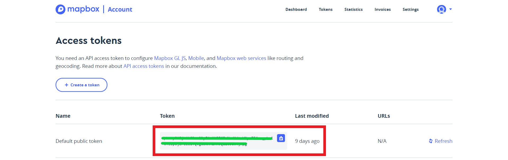


```{r}
head(maps::canada.cities)
```

```{r}
library(plotly)
Sys.setenv('MAPBOX_TOKEN' = 'pk.eyJ1IjoibGloa2lyIiwiYSI6ImNrdXdtcWNyeTE4cngybm1wYzBpbjZrZzEifQ.gdBWHAZHRJQL265am4jHpg')

plot_mapbox(maps::canada.cities) %>%
  add_markers(
    x = ~long,
    y = ~lat,
    size = ~pop,
    color = ~country.etc,
    colors = "Accent",
    text = ~paste(name, pop),
    hoverinfo = "text"
  )
```

- El estilo del mapa base de `Mapbox` se controla a través del atributo `layout.mapbox.style`. El paquete de `plotly` viene con soporte para 7 estilos diferentes, pero también puedes suministrar una `URL` personalizada a un estilo `mapbox` personalizado. Para obtener todos los nombres de estilo de mapa base pre-empaquetados, puedes tomarlos del esquema oficial `plotly.js()`. Antes debes instalar `listviewer` para que funcione la siguiente orden

```{r}
styles <- schema()$layout$layoutAttributes$mapbox$style$values
styles
```

- Cualquiera de estos valores puede ser utilizado para un estilo `mapbox`. La siguiente figura muestra el mapa base de imágenes terrestres por satélite.

```{r}
layout(plot_mapbox(), mapbox = list(style = "satellite"))
```

- Ahora veamos cómo crear un menú desplegable integrado en `plotly.js` para controlar el estilo del mapa base a través del atributo `layout.updatemenus`. La idea detrás de un menú desplegable integrado de `plotly.js` es proporcionar una lista de botones (es decir, elementos de menú) donde cada botón invoca un método de `plotly.js` con algunos argumentos. En este caso, cada botón utiliza el método `relayout` para modificar el atributo `layout.mapbox.style`.


```{r}
style_buttons <- lapply(styles, function(s) {
  list(
    label = s, 
    method = "relayout", 
    args = list("mapbox.style", s)
  )
})
layout(
  plot_mapbox(), 
  mapbox = list(style = "dark"),
  updatemenus = list(
    list(y = 0.8, buttons = style_buttons)
  )
)
```

- La otra solución de mapeo integrada en `plotly` es `plot_geo()`. En comparación con `plot_mapbox()`, este enfoque tiene soporte para diferentes proyecciones de mapeo, pero el estilo del mapa base es limitado y puede ser más engorroso. La siguiente rutina muestra el uso de `plot_geo()` junto con `add_markers()` y `add_segments()` para visualizar las rutas de vuelo dentro de los Estados Unidos. Mientras que `plot_mapbox()` está fijado a una proyección mercator, el constructor `plot_geo()` tiene un puñado de proyecciones diferentes disponibles, incluyendo la proyección ortográfica que da la ilusión del globo 3D.


```{r}
library(plotly)
library(dplyr)

air <- read.csv('https://plotly-r.com/data-raw/airport_locations.csv')

flights <- read.csv('https://plotly-r.com/data-raw/flight_paths.csv')

flights$id <- seq_len(nrow(flights))

geo <- list(
  projection = list(
    type = 'orthographic',
    rotation = list(lon = -100, lat = 40, roll = 0)
  ),
  showland = TRUE,
  landcolor = toRGB("gray95"),
  countrycolor = toRGB("gray80")
)

plot_geo(color = I("red")) %>%
  add_markers(
    data = air, x = ~long, y = ~lat, text = ~airport,
    size = ~cnt, hoverinfo = "text", alpha = 0.5
  ) %>%
  add_segments(
    data = group_by(flights, id),
    x = ~start_lon, xend = ~end_lon,
    y = ~start_lat, yend = ~end_lat,
    alpha = 0.3, size = I(1), hoverinfo = "none"
  ) %>%
  layout(geo = geo, showlegend = FALSE)
```

## Mapas coropléticos

- Además de los trazos de dispersión, ambas soluciones de mapeo integrado (es decir, `plot_mapbox()` y `plot_geo()`) tienen un tipo de trazo de coroplético optimizado (es decir, los tipos `choroplethmapbox` y `choropleth` trace). Comparativamente, `choroplethmapbox` es más potente porque se puede especificar completamente la colección de características utilizando `GeoJSON`, pero el `choropleth` trace puede ser un poco más fácil de utilizar si se ajusta a su caso de uso.

La siguiente rutina muestra la densidad de población de los Estados Unidos a través del trazado de coropletas utilizando los datos de los estados de los Estados Unidos del paquete de conjuntos de datos (`R` Core Team 2016). Con solo proporcionar un atributo `z`, los objetos de `plotly_geo()` intentarán crear un `coropleto`, pero también tendrá que proporcionar ubicaciones y un modo de ubicación. Vale la pena señalar que el modo de ubicación se limita actualmente a los países y los estados de EE.UU., por lo que si necesita una unidad geográfica diferente (por ejemplo, condados, municipios, etc.), debe utilizar el tipo de trazado `choroplethmapbox` y/o utilizar un enfoque de mapeo "personalizado" que revisaremos mas adelante


```{r}
density <- state.x77[, "Population"] / state.x77[, "Area"]

g <- list(
  scope = 'usa',
  projection = list(type = 'albers usa'),
  lakecolor = toRGB('white')
)

plot_geo() %>%
  add_trace(
    z = ~density, text = state.name, span = I(0),
    locations = state.abb, locationmode = 'USA-states'
  ) %>%
  layout(geo = g)
```

- `Choroplethmapbox` es más flexible que `choropleth` porque usted suministra su propia definición `GeoJSON` del `choropleth` a través del atributo `geojson`. Actualmente este atributo debe ser una `URL` que apunte a un archivo `geojson`. Además, la ubicación debe apuntar a un atributo `id` de nivel superior de cada característica dentro del archivo `geojson`. La siguiente figura muestra cómo podríamos visualizar la información anterior, pero esta vez utilizando `choroplethmapbox`

```{r}
plot_ly() %>%
  add_trace(
    type = "choroplethmapbox",
    geojson = paste(c(
      "https://gist.githubusercontent.com/cpsievert/",
      "7cdcb444fb2670bd2767d349379ae886/raw/",
      "cf5631bfd2e385891bb0a9788a179d7f023bf6c8/", 
      "us-states.json"
    ), collapse = ""),
    locations = row.names(state.x77),
    z = state.x77[, "Population"] / state.x77[, "Area"],
    span = I(0)
  ) %>%
  layout(
    mapbox = list(
      style = "light",
      zoom = 4,
      center = list(lon = -98.58, lat = 39.82)
    )
  ) %>%
  config(
    mapboxAccessToken = Sys.getenv("MAPBOX_TOKEN"),
    toImageButtonOptions = list(
      format = "svg", 
      width = NULL, 
      height = NULL
    )
  )
```

- Las figuras anteriores no son una forma ideal de visualizar la población estatal desde el punto de vista de la percepción gráfica. Normalmente utilizamos el color en las `coropletas` para codificar una variable numérica (por ejemplo, el PIB, las exportaciones netas, la nota media de la selectividad, etc.) y el ojo percibe de forma natural el área que cubre un color concreto como proporcional a su efecto global. Esto acaba siendo engañoso, ya que el área que cubre el color no suele tener ninguna relación razonable con los datos codificados por el color. 


## Shiny

- Hay varios marcos diferentes para crear aplicaciones web a través de `R`, pero centraremos nuestra atención en la vinculación de gráficos `plotly` con `shiny` un paquete de `R` para crear aplicaciones web reactivas completamente en `R`. El modelo de programación reactiva de `Shiny` permite a los programadores de `R` aprovechar sus conocimientos existentes de `R` y crear aplicaciones web basadas en datos sin ninguna experiencia previa en programación web. `Shiny` en sí mismo es en gran medida agnóstico al motor utilizado para renderizar las vistas de datos (es decir, puede incorporar cualquier tipo de salida de `R`), pero el propio `shiny` también agrega algún soporte especial para interactuar con gráficos e imágenes estáticas de `R` (Chang 2017).

- Al vincular los gráficos en una aplicación web, hay compensaciones a considerar cuando se utilizan gráficos estáticos de `R` en lugar de gráficos basados en la web. Resulta que esas compensaciones se complementan muy bien con las fortalezas y debilidades relativas de la vinculación de vistas con `plotly`, lo que hace que su combinación sea un potente conjunto de herramientas para vincular vistas en la web desde `R.` El propio `Shiny` proporciona una forma de acceder a eventos con gráficos estáticos hechos con cualquiera de los siguientes paquetes de `R`: `graphics, ggplot2` y `lattice`. Estos paquetes son muy maduros, con todas las funciones, bien probados, y soportan una gama increíblemente amplia de gráficos, pero como deben ser regenerados en el servidor, son fundamentalmente limitados desde una perspectiva de gráficos interactivos. Comparativamente, `plotly` no tiene la misma gama e historia, pero proporciona más opciones y control sobre la interactividad. Más concretamente, debido a que `plotly` está intrínsecamente basado en la web, permite un mayor control sobre cómo se actualizan los gráficos en respuesta a la entrada del usuario (por ejemplo, cambiar el color de unos pocos puntos en lugar de redibujar toda la imagen). Esta sección aborda el cómo utilizar gráficos `plotly` dentro de `shiny`, cómo conseguir que esos gráficos se comuniquen con otros tipos de vistas de datos, y cómo hacerlo todo de forma eficiente. 


### Su primera aplicación Shiny

- El patrón más común de `plotly+shiny` utiliza una entrada de `shiny` para controlar una salida de `plotly`. Mostraremos un ejemplo sencillo de uso de la función `selectizeInput()` de `shiny` para crear un desplegable que controla un gráfico de `plotly`. Este ejemplo, así como cualquier otra aplicación `shiny`, tiene dos partes principales:

  - La interfaz de usuario, `ui`, define cómo se muestran los widgets de entrada y salida en la página. La función `fluidPage()` ofrece una forma agradable y rápida de obtener un diseño responsivo basado en una cuadrícula, pero también vale la pena señalar que la `UI` es completamente personalizable, y paquetes como `shinydashboard` facilitan el aprovechamiento de marcos de diseño más sofisticados (Chang y Borges Ribeiro 2018).
  
  - La función del servidor, `server`, define un mapeo de los valores de entrada a los widgets de salida. Más concretamente, el servidor `shiny` es una `R function()` entre los valores ingresados por el cliente y las salidas generadas en el servidor web.

- Cada widget de entrada, incluido el `selectizeInput()`, está vinculado a un valor de entrada al que se puede acceder en el servidor dentro de una expresión reactiva. Las expresiones reactivas de `Shiny` construyen un gráfico de dependencia entre las salidas (también conocidas como puntos finales reactivos) y las entradas (también conocidas como fuentes reactivas). La verdadera potencia de las expresiones reactivas reside en su capacidad para encadenar y almacenar en caché los cálculos, pero centrémonos primero en la generación de salidas. Para generar una salida, tienes que elegir una función adecuada para renderizar el resultado de una expresión reactiva.

- La siguiente rutina utiliza la función `renderPlotly()` para renderizar una expresión reactiva que genera un gráfico `plotly`. Esta expresión depende del valor de entrada `input$cities` (es decir, el valor de entrada ligado al widget de entrada con un `inputId` de `"cities"`) y almacena la salida como `output$p`. Esto indica a `shiny` que inserte el gráfico reactivo en el contenedor `plotlyOutput(outputId = "p")` definido en la interfaz de usuario.


```{r eval=FALSE}
library(shiny)
library(plotly)

ui <- fluidPage(
  selectizeInput(
    inputId = "cities", 
    label = "Select a city", 
    choices = unique(txhousing$city), 
    selected = "Abilene",
    multiple = TRUE
  ),
  plotlyOutput(outputId = "p")
)

server <- function(input, output, ...) {
  output$p <- renderPlotly({
    plot_ly(txhousing, x = ~date, y = ~median) %>%
      filter(city %in% input$cities) %>%
      group_by(city) %>%
      add_lines()
  })
}

shinyApp(ui, server)
```

```{r}
library("vembedr")
embed_url("https://youtu.be/htnDHPpnZbs")
```

- Si, en lugar de un gráfico `plotly`, una expresión reactiva genera un gráfico `R` estático, simplemente utilice `renderPlot()` (en lugar de `renderPlotly()`) para renderizarlo y `plotOutput()` (en lugar de `plotlyOutput()`) para posicionarlo. Otros widgets de salida `shiny` utilizan esta convención de nombres: `renderDataTable()/datatableOutput(), renderPrint()/verbatimTextOutput(), renderText()/textOutput(), renderImage()/imageOutput()`, etc. Los paquetes que se basan en el estándar `htmlwidgets` (por ejemplo, `plotly` y `leaflet`) son, en cierto sentido, también widgets de salida de `Shiny` que se animan a seguir esta misma convención de nombres (por ejemplo, `renderPlotly()/plotlyOutput()` y `renderLeaflet()/leafletOutput()`).

- `Shiny` también viene preempaquetado con un puñado de otros widgets de entrada útiles. Aunque muchas aplicaciones de `Shiny` los utilizan directamente` "out-of-the-box"`, los widgets de entrada pueden estilizarse fácilmente con `CSS` y/o `SASS`, e incluso se pueden integrar widgets de entrada personalizados (Mastny 2018; RStudio 2014a). 

  - `selectInput()/selectizeInput()` para los menús desplegables.
  - `numericInput()` para un solo número.
  - `sliderInput()` para un rango numérico.
  - `textInput()` para una cadena de caracteres.
  - `dateInput()` para una sola fecha. 
  - `dateRangeInput()` para un rango de fechas.
  - `fileInput()` para subir archivos.
  - `checkboxInput()/checkboxGroupInput()/radioButtons()` para elegir una lista de opciones.

- A partir de ahora nuestro enfoque es enlazar múltiples gráficos en `shiny` a través de la manipulación directa, por lo que nos centramos menos en el uso de estos widgets de entrada, y más en el uso de `plotly` y los gráficos estáticos de `R` como entradas a otros widgets de salida.


### Ocultación y rediseño al cambiar de tamaño

- La función `renderPlotly()` renderiza cualquier cosa que la función `plotly_build()` entienda, incluyendo los objetos `plot_ly(), ggplotly()` y `ggplot2`. También renderiza `NULL` como un `div` `HTML` vacío, lo que es útil para ciertos casos en los que no tiene sentido renderizar un gráfico. La siguiente rutina aprovecha estas características para representar un `div` vacío mientras se muestra el marcador de posición de `selectizeInput()`, pero luego representa un gráfico `plotly` mediante `ggplotly()` una vez que se han seleccionado las ciudades. También muestra cómo hacer que la salida de `plotly` dependa del tamaño del contenedor que contiene el gráfico de `plotly`. Por defecto, cuando un navegador cambia de tamaño, el tamaño del gráfico se cambia puramente del lado del cliente, pero esta expresión reactiva se reejecutará cuando la ventana del navegador cambie de tamaño. Debido a razones técnicas, esto puede mejorar el comportamiento del redimensionamiento de `ggplotly()`, pero debe usarse con precaución cuando se manejan grandes datos y largos tiempos de representación.


```{r eval=FALSE}
library(shiny)

cities <- unique(txhousing$city)

ui <- fluidPage(
  selectizeInput(
    inputId = "cities", 
    label = NULL,
    choices = c("Please choose a city" = "", cities), 
    multiple = TRUE
  ),
  plotlyOutput(outputId = "p")
)

server <- function(input, output, session, ...) {
  output$p <- renderPlotly({
    req(input$cities)
    if (identical(input$cities, "")) return(NULL)
    p <- ggplot(data = filter(txhousing, city %in% input$cities)) + 
      geom_line(aes(date, median, group = city))
    height <- session$clientData$output_p_height
    width <- session$clientData$output_p_width
    ggplotly(p, height = height, width = width)
  })
}

shinyApp(ui, server)
```

```{r}
library("vembedr")
embed_url("https://youtu.be/Szj_CiDz1WI")
```

### Eventos de alcance

- Esta sección aprovecha la interfaz para acceder a los eventos de entrada de `plotly` para informar a otras vistas de datos sobre esos eventos. Cuando se gestionan múltiples vistas que se comunican entre sí, es necesario saber qué vistas son una fuente de interacción y cuáles son un objetivo (¡una vista puede ser ambas cosas a la vez!). La función `event_data()` proporciona un argumento de origen para ayudar a refinar qué vista(s) sirve(n) como fuente de un evento. El argumento fuente toma un `ID` de cadena, y cuando ese `ID` coincide con la fuente de un gráfico de `plot_ly()/ggplotly()`, entonces el `event_data()` se "asigna" a esa vista. Para tener una mejor idea de cómo funciona esto, considere el siguiente videoclip

- Nótese que permite hacer clic en una celda de un mapa de calor de correlación para generar un gráfico de dispersión de las dos variables correspondientes, lo que permite ver más de cerca su relación. En el caso de un mapa de calor, los datos de eventos vinculados a un evento `plotly_click` contienen las categorías `x` e `y` relevantes (por ejemplo, los nombres de las variables de datos de interés) y el valor `z` (por ejemplo, la correlación de Pearson entre esas variables). Para obtener los datos de los clics del mapa térmico, y sólo del mapa térmico, es importante que el argumento fuente de la función `event_data()` coincida con el argumento fuente de `plot_ly()`. De lo contrario, si el argumento fuente no se especificara `event_data("plotly_click")` también se dispararía cuando el usuario hiciera clic en el gráfico de dispersión, causando probablemente un error


```{r eval=FALSE}
library(shiny)

# cache computation of the correlation matrix
correlation <- round(cor(mtcars), 3)

ui <- fluidPage(
  plotlyOutput("heat"),
  plotlyOutput("scatterplot")
)

server <- function(input, output, session) {
  
  output$heat <- renderPlotly({
    plot_ly(source = "heat_plot") %>%
      add_heatmap(
        x = names(mtcars), 
        y = names(mtcars), 
        z = correlation
      )
  })
  
  output$scatterplot <- renderPlotly({
    # if there is no click data, render nothing!
    clickData <- event_data("plotly_click", source = "heat_plot")
    if (is.null(clickData)) return(NULL)
    
    # Obtain the clicked x/y variables and fit linear model
    vars <- c(clickData[["x"]], clickData[["y"]])
    d <- setNames(mtcars[vars], c("x", "y"))
    yhat <- fitted(lm(y ~ x, data = d))
    
    # scatterplot with fitted line
    plot_ly(d, x = ~x) %>%
      add_markers(y = ~y) %>%
      add_lines(y = ~yhat) %>%
      layout(
        xaxis = list(title = clickData[["x"]]), 
        yaxis = list(title = clickData[["y"]]), 
        showlegend = FALSE
      )
  })
  
}

shinyApp(ui, server)
```


```{r}
library("vembedr")
embed_url("https://youtu.be/QXUVPiSZHcw")
```


### Drill-down

- La siguiente app muestra las ventas desglosadas por categoría de negocio (por ejemplo, muebles, material de oficina, tecnología) en un gráfico circular. Permite al usuario hacer clic en una porción de la tarta para "profundizar" en las subcategorías de la categoría elegida. En términos de implementación, el aspecto clave aquí es mantener el estado de la categoría actualmente seleccionada a través de un `reactiveVal()` y actualizar ese valor cuando se hace clic en una categoría o se pulsa el botón "Back". Esto puede parecer mucho código para obtener un gráfico circular básico de desglose, pero los conceptos centrales de reactividad en esta implementación se traducen bien a aplicaciones de desglose más complejas.


```{r eval=FALSE}
library(shiny)
library(dplyr)
library(readr)
library(purrr) # just for `%||%`

sales <- read_csv("https://plotly-r.com/data-raw/sales.csv")
categories <- unique(sales$category)

ui <- fluidPage(plotlyOutput("pie"), uiOutput("back"))

server <- function(input, output, session) {
  # for maintaining the current category (i.e. selection)
  current_category <- reactiveVal()
  
  # report sales by category, unless a category is chosen
  sales_data <- reactive({
    if (!length(current_category())) {
      return(count(sales, category, wt = sales))
    }
    sales %>%
      filter(category %in% current_category()) %>%
      count(sub_category, wt = sales)
  })
  
  # Note that pie charts don't currently attach the label/value 
  # with the click data, but we can include as `customdata`
  output$pie <- renderPlotly({
    d <- setNames(sales_data(), c("labels", "values"))
    plot_ly(d) %>%
      add_pie(
        labels = ~labels, 
        values = ~values, 
        customdata = ~labels
      ) %>%
      layout(title = current_category() %||% "Total Sales")
  })
  
  # update the current category when appropriate
  observe({
    cd <- event_data("plotly_click")$customdata[[1]]
    if (isTRUE(cd %in% categories)) current_category(cd)
  })
  
  # populate back button if category is chosen
  output$back <- renderUI({
    if (length(current_category())) 
      actionButton("clear", "Back", icon("chevron-left"))
  })
  
  # clear the chosen category on back button press
  observeEvent(input$clear, current_category(NULL))
}

shinyApp(ui, server)
```

```{r}
library("vembedr")
embed_url("https://youtu.be/wAfmLwyHPWU")
```

- Un desglose básico como el de la app anterior es algo útil por sí mismo, pero se vuelve mucho más útil cuando se vincula a múltiples vistas de los datos. La siguiente rutina mejora la app anteriror para mostrar las ventas a lo largo del tiempo por categoría o subcategoría (si se elige una categoría). Observe que el aspecto clave de la implementación sigue siendo el mismo (es decir, el mantenimiento del estado a través de `reactiveValue()`), la principal diferencia es que la vista de la serie de tiempo ahora también responde a los cambios en la categoría actualmente seleccionada. Es decir, ambas vistas muestran las ventas por categoría cuando no se selecciona ninguna categoría, y las ventas por subcategoría cuando se selecciona una categoría.

```{r eval=FALSE}
library(shiny)
library(dplyr)
library(readr)
library(plotly)
library(purrr)

sales <- read_csv("https://plotly-r.com/data-raw/sales.csv")
categories <- unique(sales$category)

ui <- fluidPage(
  plotlyOutput("bar"),
  uiOutput("back"),
  plotlyOutput("time")
)

server <- function(input, output, session) {
  
  current_category <- reactiveVal()
  
  # report sales by category, unless a category is chosen
  sales_data <- reactive({
    if (!length(current_category())) {
      return(count(sales, category, wt = sales))
    }
    sales %>%
      filter(category %in% current_category()) %>%
      count(sub_category, wt = sales)
  })
  
  # the pie chart
  output$bar <- renderPlotly({
    d <- setNames(sales_data(), c("x", "y"))
    
    plot_ly(d) %>%
      add_bars(x = ~x, y = ~y, color = ~x) %>%
      layout(title = current_category() %||% "Total Sales")
  })
  
  # same as sales_data
  sales_data_time <- reactive({
    if (!length(current_category())) {
      return(count(sales, category, order_date, wt = sales))
    }
    sales %>%
      filter(category %in% current_category()) %>%
      count(sub_category, order_date, wt = sales)
  })
  
  output$time <- renderPlotly({
    d <- setNames(sales_data_time(), c("color", "x", "y"))
    plot_ly(d) %>%
      add_lines(x = ~x, y = ~y, color = ~color)
  })
  
  # update the current category when appropriate
  observe({
    cd <- event_data("plotly_click")$x
    if (isTRUE(cd %in% categories)) current_category(cd)
  })
  
  # populate back button if category is chosen
  output$back <- renderUI({
    if (length(current_category())) 
      actionButton("clear", "Back", icon("chevron-left"))
  })
  
  # clear the chosen category on back button press
  observeEvent(input$clear, current_category(NULL))
}

shinyApp(ui, server)
```

```{r}
library("vembedr")
embed_url("https://youtu.be/9sp1vUgmHLI")
```

### Despliegue de aplicación Shiny

- La plataforma `shinyapps.io` es bastante usada para desplegar aplicaciones `Shiny`. Por lo tanto para seguir con los siguientes pasos debe crearse una cuenta en [shinyapps.io](https://www.shinyapps.io/). `shinyapps.io` ofrece un plan gratuito, pero está limitado a 5 aplicaciones activas y a un uso mensual de 25 horas activas máximo. Si despliegas tu aplicación a disposición de un público amplio, esperarías superar el límite mensual de horas activas con bastante rapidez. Para aumentar el límite mensual (o para publicar más de 5 aplicaciones), tendrás que actualizar tu plan a uno de pago.

1. Abra `RStudio` y cree una nueva aplicación `Shiny`

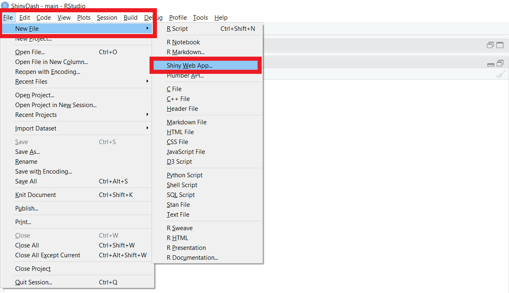

2. Asignele un nombre (sin espacio), elige dónde guardarlo y haz clic en el botón `Create`

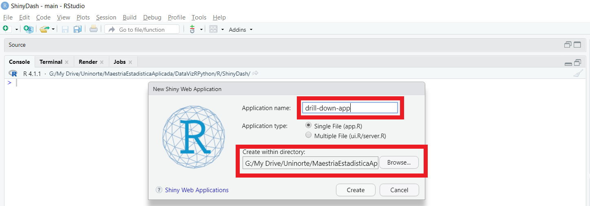

3. Luego de esto cipe en la app por defecto el código por ejemplo de la anterior app creada para el `drill-down`. De la misma manera que cuando se abre un nuevo documento `R Markdown`, se crea el código para una aplicación `Shiny` básica. Ejecute la aplicación haciendo clic en el botón `Run App` para ver el resultado

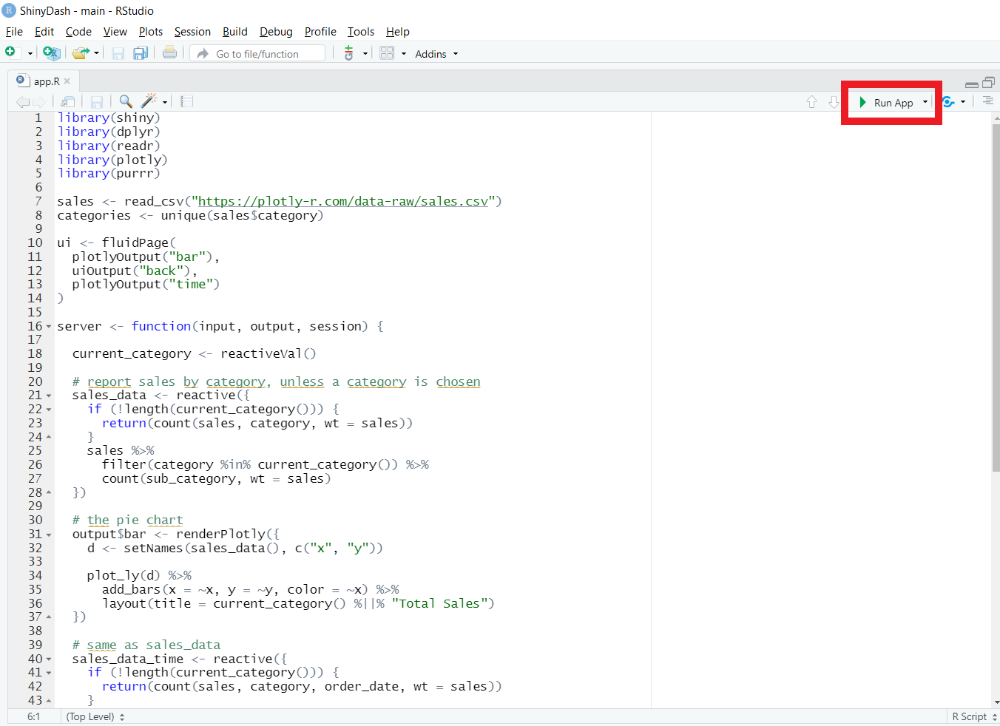
4. Se abrirá la app. Para publicarla, debemos hacer click en el botón `Publish`

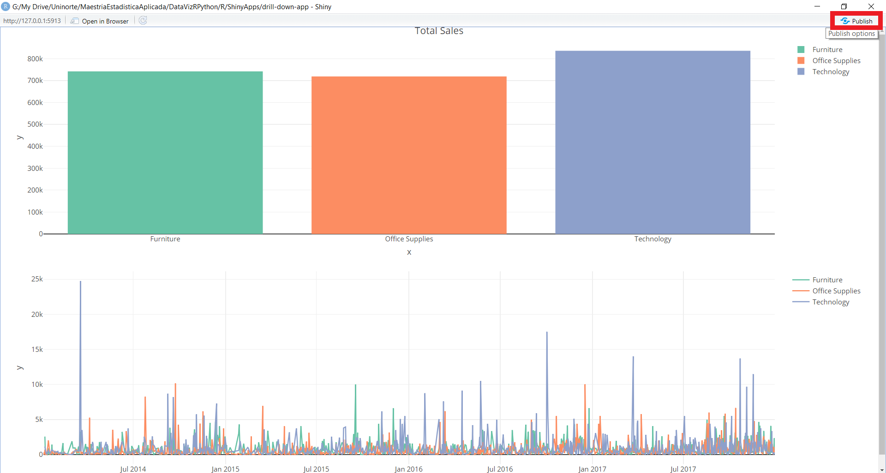

- Luego de esto hacemos click en `ShinyApps.io` para conectarnos a nuestra cuenta, creada anteriormente

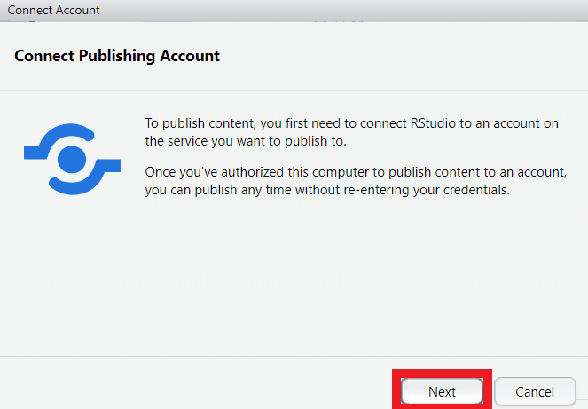


5. Luego de esto necesitaremos un token para poder conectar nuestra app al servidor de `ShinyApps.io`. Con este fin, seguimos las instrucciones que aparecen en la ventana, esto es, vamos a nuestra cuenta y hacemos click en nuestro nombre de usuario, luego presionamos el boton `Tokens`, despues de esto hacemos click en `Show` para visualizar el token, luego `Show secret/Copy to clipboard`. Luego de realizar esto, pegamos nuestro token en la ventana de publicación de nuestra app

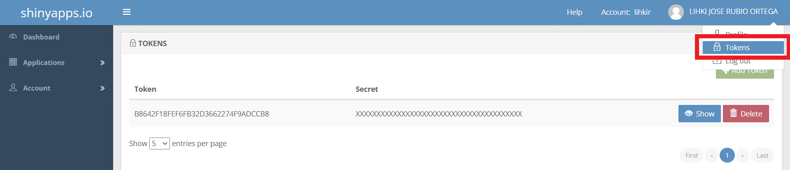
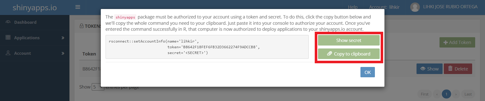

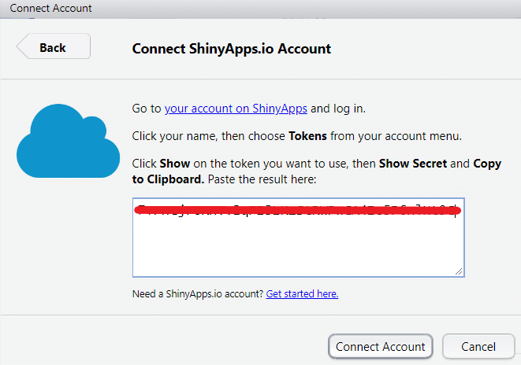

6. Luego le va a aparecer la siguiente ventana con la opción de publicar su aplicación. Haga click en `Publish`

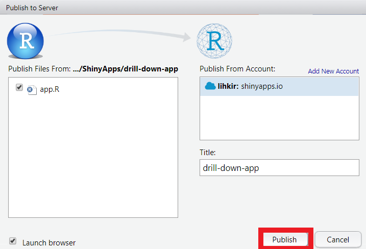

7. Después de varios segundos (dependiendo del peso de su aplicación), la aplicación Shiny debería aparecer en su navegador de Internet. Para volver a desplegar la aplicación puede hacerlo desde su aplicación haciendo click en el botón resaltado en la imagen y deberá visualizar su despliegue en la parte inferior. Ahora puede realizar cambio y usar sólo ese botón cuando desde hacer el despliegue de su aplicación. La app de este ejemplo ha sido publicada en el siguiente link [https://lihkir.shinyapps.io/drill-down-app/](https://lihkir.shinyapps.io/drill-down-app/).  

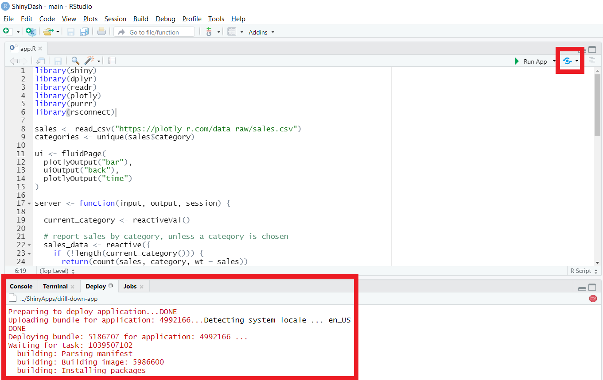


8. Puede revisar en su cuenta que se ha creado satisfactoriamente su aplicación. Puede visualizar las conexiones y demás información en los botones que se resaltan en rojo. Revise que información entrega cada uno.

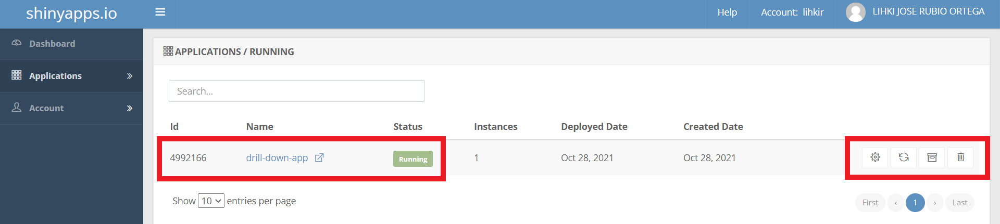

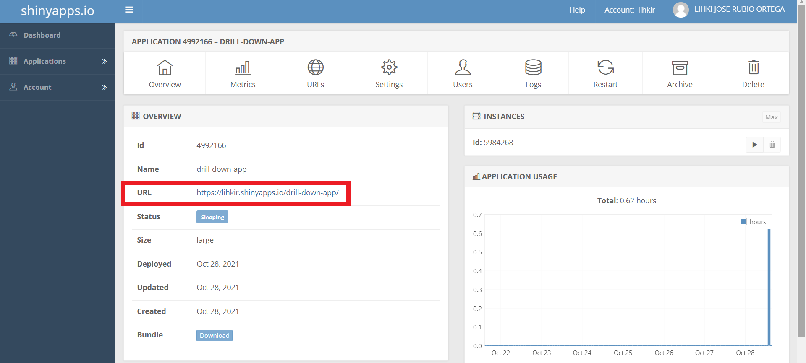


